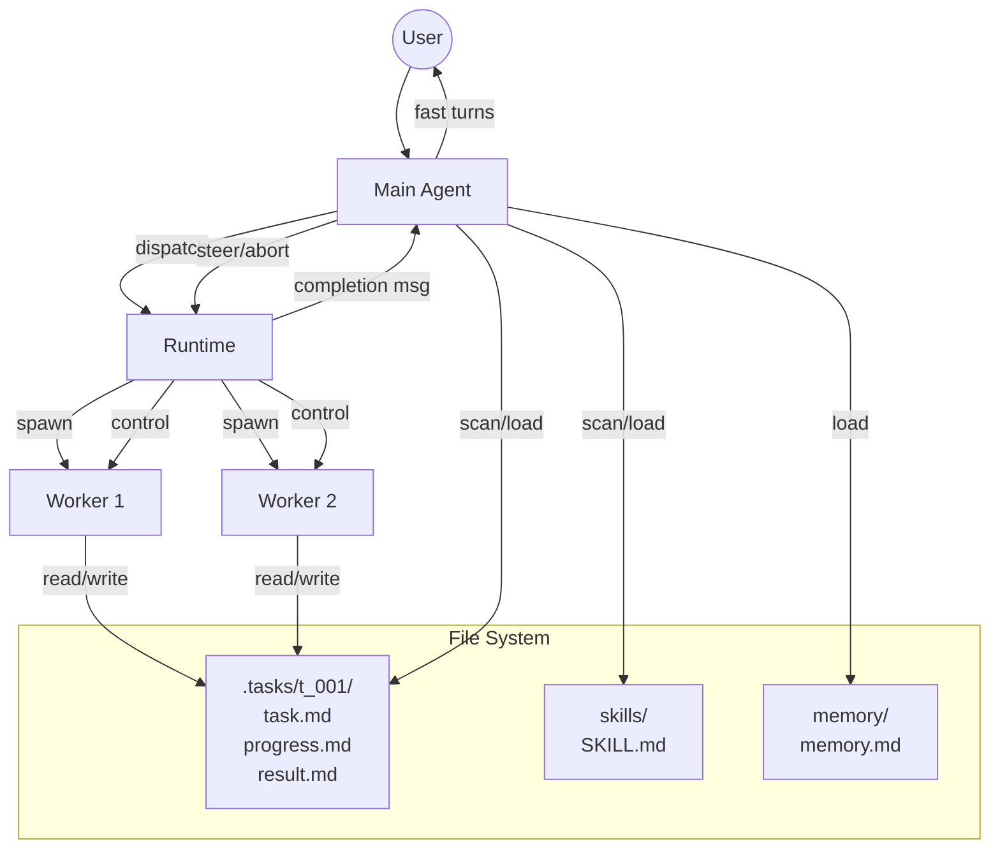
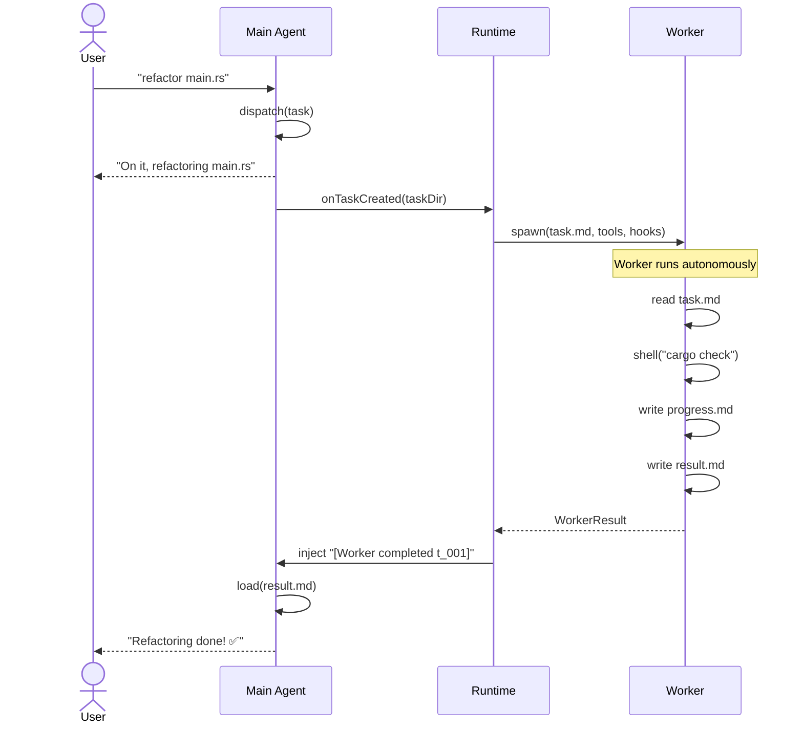
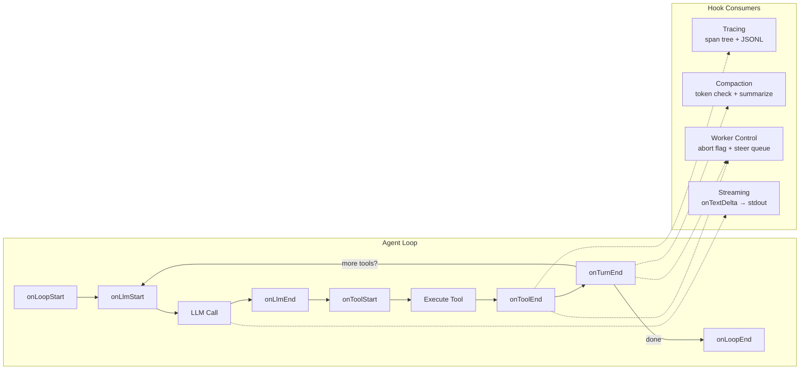

# picoagent

A minimal agent framework for AI assistants. Small enough to understand, powerful enough to use.

## Why

Existing agent frameworks are powerful but complex — 50+ modules, deep abstraction layers, enterprise-grade config systems. For a single user who just wants a personal AI agent, most of that complexity is unnecessary.

**picoagent** strips the agent down to its essence:
- **~950 lines of core** that stabilize after v1
- **File-based state** for tasks, memory, and progress
- **Hook-based observability** — tracing, compaction, worker control, streaming all via composable hooks
- **Extensible via tools and skills**, not code changes
- **Everything is a markdown file with frontmatter** — one pattern for all discovery and retrieval

## Architecture

### System Overview



### Use Case: Dispatching Work



### Data Flow: Hooks Lifecycle



### Main Agent + Async Workers

```
┌──────────────────────────────────────────┐
│              Main Agent                   │
│                                           │
│  ✦ Receives all user messages             │
│  ✦ Fast turns — routing + simple answers  │
│  ✦ Dispatches heavy work to Workers       │
│  ✦ Gets notified when Workers complete    │
│  ✦ Reads progress / relays results        │
│                                           │
│  Tools:                                   │
│    dispatch(task) — spawn async Worker     │
│    steer(id, msg) — redirect a Worker      │
│    abort(id)      — cancel a Worker        │
│    scan(dir)      — search by frontmatter  │
│    load(path)     — read full content      │
│    shell / read / write — simple tasks     │
├──────────────────────────────────────────┤
│               Runtime                     │
│                                           │
│  ✦ Routes user messages to Main Agent     │
│  ✦ Manages Worker lifecycle               │
│  ✦ Manages WorkerControl per task         │
│  ✦ Injects completion messages            │
│     (Worker done → wake Main Agent)       │
├──────────────────────────────────────────┤
│           Workers (async, ×N)             │
│                                           │
│  ✦ One Worker = one task directory         │
│  ✦ Runs tool-calling loop                 │
│  ✦ Updates progress.md after each step    │
│  ✦ Controlled via hooks (abort/steer)     │
│  ✦ Never talks to user directly           │
│  ✦ Completion triggers Main Agent wakeup  │
│                                           │
│  Tools:                                   │
│    shell / read / write                   │
│    scan / load                            │
│    + skill-provided tools                 │
└──────────────────────────────────────────┘
```

## Core Concepts

### Hooks System

The agent loop supports a composable **hook system** for lifecycle observation and control. Hooks are optional — zero overhead when not provided.

```typescript
interface AgentHooks {
  onLoopStart?(): void | Promise<void>;
  onLoopEnd?(turns: number): void | Promise<void>;
  onLlmStart?(messages: Message[]): void | Promise<void>;
  onLlmEnd?(response: AssistantMessage, durationMs: number): void | Promise<void>;
  onToolStart?(call: ToolCall): void | Promise<void>;
  onToolEnd?(call: ToolCall, result: ToolResultMessage, durationMs: number):
    ToolResultMessage | void | Promise<ToolResultMessage | void>;
  onTurnEnd?(messages: Message[]): void | Promise<void>;
  onTextDelta?(text: string): void;
  onError?(error: Error): void | Promise<void>;
}
```

Multiple hooks compose via `combineHooks()`:

```typescript
const hooks = combineHooks(
  createTraceHooks(tracer, "claude-sonnet"),   // observability
  createCompactionHooks(provider, config),      // context management
  createWorkerControlHooks(control, taskId),    // abort + steer
  { onTextDelta: (t) => process.stdout.write(t) } // streaming
);
```

Built-in hook adapters:
- **`createTraceHooks(tracer)`** — JSONL tracing with span tree reconstruction
- **`createCompactionHooks(provider, config)`** — automatic context compaction when token threshold exceeded
- **`createWorkerControlHooks(control, taskId)`** — abort flag + steer message queue

### Agent Loop

The heart of picoagent — a unified tool-calling loop used by both Main Agent and Workers:

```
runAgentLoop(messages, tools, provider, context, systemPrompt?, hooks?) {
  hooks.onLoopStart()

  loop {
    hooks.onLlmStart(messages)
    response = provider.complete(messages, tools)  // or .stream() if onTextDelta
    hooks.onLlmEnd(response, duration)

    if no tool calls → hooks.onLoopEnd(turns) → return

    for each tool_call:
      hooks.onToolStart(tool_call)
      result = execute_tool(tool_call)
      result = hooks.onToolEnd(tool_call, result, duration) || result
      messages.push(result)

    hooks.onTurnEnd(messages)
  }
}
```

One function handles both streaming and non-streaming: if `hooks.onTextDelta` is set, the loop uses `provider.stream()`. Otherwise `provider.complete()`.

### Provider Abstraction

The agent loop never imports any SDK. All LLM-specific code lives behind the `Provider` interface:

```typescript
interface Provider {
  model: string;
  complete(messages, tools, systemPrompt?): Promise<AssistantMessage>;
  stream(messages, tools, systemPrompt?): AsyncIterable<StreamEvent>;
}
```

Currently implemented: `AnthropicProvider` (Claude), `OpenAIProvider` (GPT + compatible APIs), `GeminiProvider` (Gemini). Adding more = one new file in `src/providers/`.

Configure via `config.md` in the workspace root:
```markdown
---
provider: anthropic
model: claude-sonnet-4-20250514
max_tokens: 4096
context_window: 200000
---
```

For OpenAI-compatible APIs, add `base_url`:
```markdown
---
provider: openai
model: deepseek-chat
base_url: https://api.deepseek.com
---
```

API keys are read from environment variables: `ANTHROPIC_API_KEY`, `OPENAI_API_KEY`, `GEMINI_API_KEY`.

### Worker Control

Workers are controlled via an **in-memory message queue**, not file-based signals:

```typescript
class WorkerControl {
  abort(): void;           // set abort flag
  steer(msg: string): void; // push message to steer queue
}
```

- **Abort** — `onToolEnd` hook checks the abort flag; throws `AbortError` immediately
- **Steer** — `onTurnEnd` hook drains the steer queue and injects messages before the next LLM call

The Runtime maintains a `Map<taskId, WorkerControl>` per active worker. The `steer` and `abort` tools operate on this map via context callbacks.

### Compaction

Long sessions accumulate context. Compaction keeps agents within their context window.

**Layer 1: Tool Result Truncation** — head + tail pattern (key info often at end of output). Applied at tool execution time, before the result enters the session.

**Layer 2: Session Compaction** — implemented as a hook (`createCompactionHooks`). Fires on `onTurnEnd`, estimates token count, and when usage exceeds 75% of the context window, summarizes old messages via an LLM call and replaces them with a compact summary. File operations are extracted programmatically and appended.

### Progressive Disclosure

**Everything scannable is a markdown file with YAML frontmatter.** One pattern for all retrieval:

```yaml
---
name: "some entity"
tags: [a, b]
---
(detailed content, loaded on demand)
```

**Two tools power all retrieval:**

```typescript
scan(dir, pattern?) → DocMeta[]   // frontmatter only, supports * wildcards
load(path)          → DocFull     // frontmatter + body
```

### Trust Boundaries (Zod)

Zod validation at **trust boundaries only**:
- **Tool parameters** — LLM-generated, untrusted → Zod schema + `z.toJSONSchema()` for LLM
- **API responses** — external, untrusted → Zod validation
- **Internal types** — compiler-guaranteed → plain TypeScript interfaces

### Workspace / Core Separation

```
~/.picoagent/                     ← core (managed by runtime)
├── config.yaml
├── sessions/
│   ├── main.jsonl
│   └── workers/{task_id}.jsonl
└── traces/
    └── {trace_id}.jsonl

picoagent/defaults/               ← built-in (ships with picoagent)
├── skills/
│   ├── coding.md                     coding conventions
│   └── writing.md                    technical writing guide
└── agents/
    ├── researcher.md                 deep research (gpt-4o)
    └── reviewer.md                   code review

~/workspace/                      ← workspace (user-managed)
├── config.md                         provider/model config
├── AGENTS.md
├── SOUL.md
├── USER.md
├── memory/
│   ├── memory.md
│   └── {topic}.md
├── skills/                           user skills (override built-in by name)
├── agents/                           user agents (override built-in by name)
└── .tasks/
    ├── t_001/
    └── ...
```

### Context Separation

| Context | Main Agent | Worker |
|---------|-----------|--------|
| SOUL.md | ✅ | ❌ |
| USER.md | ✅ | ❌ |
| AGENTS.md | ✅ | ✅ |
| memory.md | ✅ | ❌ |
| Skill frontmatter | ✅ | ✅ |
| task.md | ❌ | ✅ (own only) |
| write_file | unrestricted | task dir only |

### Three Levels of Observability

| File | Granularity | Content |
|------|------------|---------|
| `progress.md` | Key milestones | `14:03 Found 5 extractable functions` |
| `traces/*.jsonl` | Every event | `{"event":"tool_start","tool":"read_file"}` |
| `sessions/*.jsonl` | Full conversation | Raw LLM messages |

## Project Structure

```
src/
├── core/                      ← kernel, 4 files, frozen after v1
│   ├── loop.ts                    agent loop (hooks-based)
│   ├── hooks.ts                   AgentHooks interface + combineHooks
│   ├── provider.ts                Provider interface
│   └── types.ts                   Message, Tool, ToolContext
│
├── runtime/                   ← orchestration
│   ├── runtime.ts                 Runtime class (message routing + workers)
│   ├── worker.ts                  runWorker
│   └── worker-control.ts         WorkerControl + abort/steer hooks
│
├── hooks/                     ← composable hook adapters
│   ├── tracing.ts                 createTraceHooks (JSONL spans)
│   └── compaction.ts              createCompactionHooks
│
├── lib/                       ← shared utilities
│   ├── config.ts                  loadConfig from workspace config.md
│   ├── frontmatter.ts             parseFrontmatter, scan, load
│   ├── prompt.ts                  buildMainPrompt, buildWorkerPrompt
│   ├── task.ts                    task directory CRUD
│   └── tracer.ts                  Tracer class (JSONL writer)
│
├── providers/                 ← SDK-specific
│   ├── index.ts                   createProvider factory
│   ├── anthropic.ts               Claude
│   ├── openai.ts                  GPT + compatible APIs (DeepSeek, Groq, etc.)
│   └── gemini.ts                  Gemini
│
├── tools/                     ← LLM tool interfaces
│   ├── shell.ts                   30s timeout + truncation
│   ├── read-file.ts / write-file.ts
│   ├── scan.ts / load.ts
│   └── dispatch.ts / steer.ts / abort.ts
│
├── main.ts                    ← REPL entry point
└── server.ts                  ← HTTP server entry point (SSE streaming)
```

**Design principle:** `core/` is the kernel — 4 files that stabilize after v1. Everything else builds on top.

## Usage

### REPL

```bash
ANTHROPIC_API_KEY=sk-... npm run dev

# or with OpenAI
OPENAI_API_KEY=sk-... npm run dev

# or with Gemini
GEMINI_API_KEY=... npm run dev
```

(Set `provider` in `config.md` to match your API key.)

### HTTP Server

```bash
ANTHROPIC_API_KEY=sk-... npm run dev:server
# listening on http://localhost:3000
```

Endpoints:

| Method | Path | Description |
|--------|------|-------------|
| `POST` | `/chat` | Send message, SSE streaming response |
| `GET` | `/tasks` | List all tasks |
| `GET` | `/tasks/:id` | Task details + progress + result |
| `POST` | `/tasks/:id/steer` | Redirect a running worker |
| `POST` | `/tasks/:id/abort` | Cancel a running worker |

**Chat SSE events:**
```
data: {"type":"delta","text":"Hello"}    ← streaming token
data: {"type":"done","text":"Hello..."}  ← final response
data: {"type":"error","error":"..."}     ← on failure
```

## TODO

- [ ] Channel integration (single channel, TBD)

## Stats

- **3576 lines** across 44 files
- **41 tests**, all passing under strict mode

## Acknowledgments

Inspired by studying the architectures of:
- [OpenClaw](https://github.com/openclaw/openclaw) — comprehensive agent framework
- [NanoClaw](https://github.com/gavrielc/nanoclaw) — minimal Claude agent with container isolation
- [pi-agent](https://github.com/pchaganti/gx-pi-agent) — lightweight coding agent

## License

MIT
